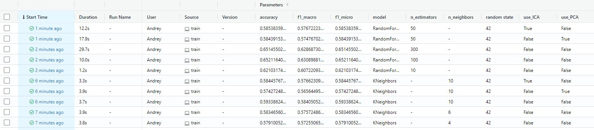
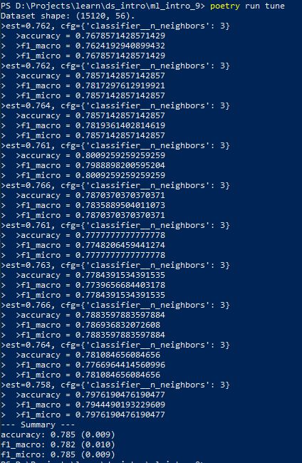
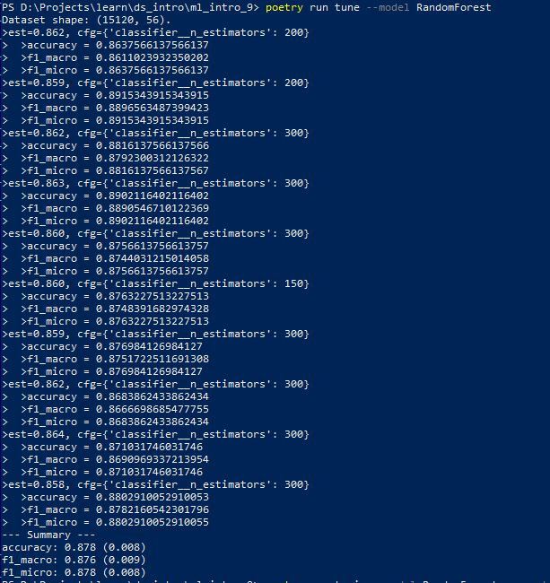

# Ml intro task 9

## Usage
This package allows you to train model to classify forest cover.
1. Clone this repository to your machine.
2. Download [Forest train dataset](https://www.kaggle.com/competitions/forest-cover-type-prediction), save train.csv locally (default path is *data/train.csv* in repository's root).
3. Make sure Python 3.10 and [Poetry](https://python-poetry.org/docs/) are installed on your machine (I use Poetry 1.1.13).
4. Install the project dependencies (*run this and following commands in a terminal, from the root of a cloned repository*):
```sh
poetry install --no-dev
```
5. Run train with the following command:
```sh
poetry run train
```
You can configure additional options (such as hyperparameters) in the CLI. To get a full list of them, use help:
```sh
poetry run train --help
```
6. Run MLflow UI to see the information about experiments you conducted:
```sh
poetry run mlflow ui
```
7. You may run script to produce EDA for dataset, result will be saved to reports directory
```sh
poetry run eda
```
8. You may run script to tune hyperparameters for model
```sh
poetry run tune
```

## Some results


## Tuning

### K-Neighbors

### Random Forest


## Developer info 

Created by `poetry new --src ml_intro_9` command

using `poetry add <module name>` to install dependency